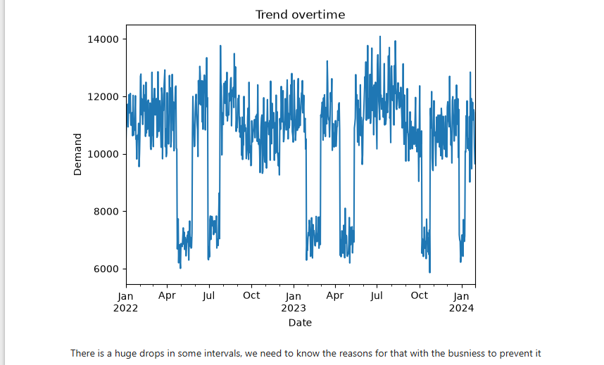

# Demand-forecasting
I will use the time series modeling for analysis, using historical sales data over time to predict future customer demand.
# Data
all the features are clearly describe itself.
# Pipeline
-cleaning the data and make sure from the NAN and the duplicates, dividing the date column to year, month and day to make it easier in tracking and visualization.  
-investigating and identifying the behavior and the demand of the customers with deep queries to take overall idea.  
## Always make sure from answering the thoughtful question inside my head to deeply understand the business and make some insights at the beginning
-Visualization to make the ideas more clear and track it easily  
# Use the time series analysis and visualize it for trends and rates  
-Most important ones:  
# The daily trend for the demand  

